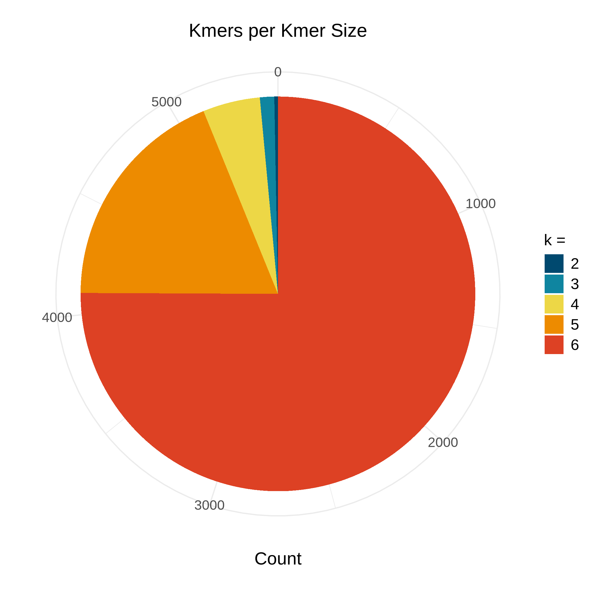
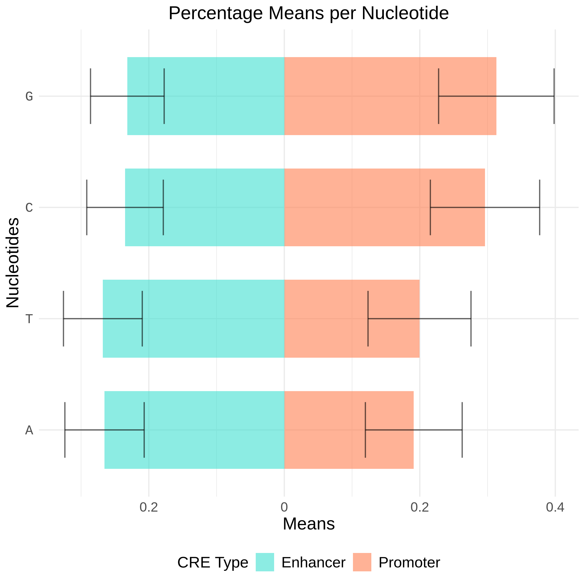
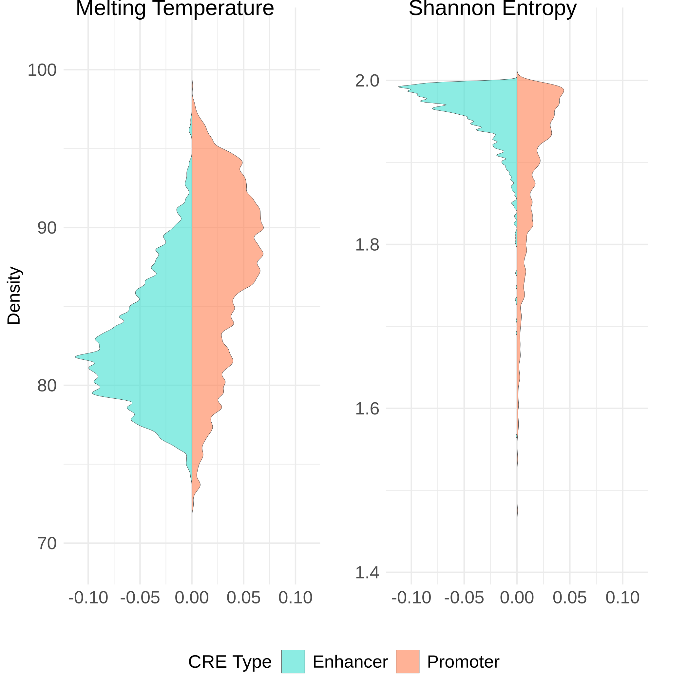
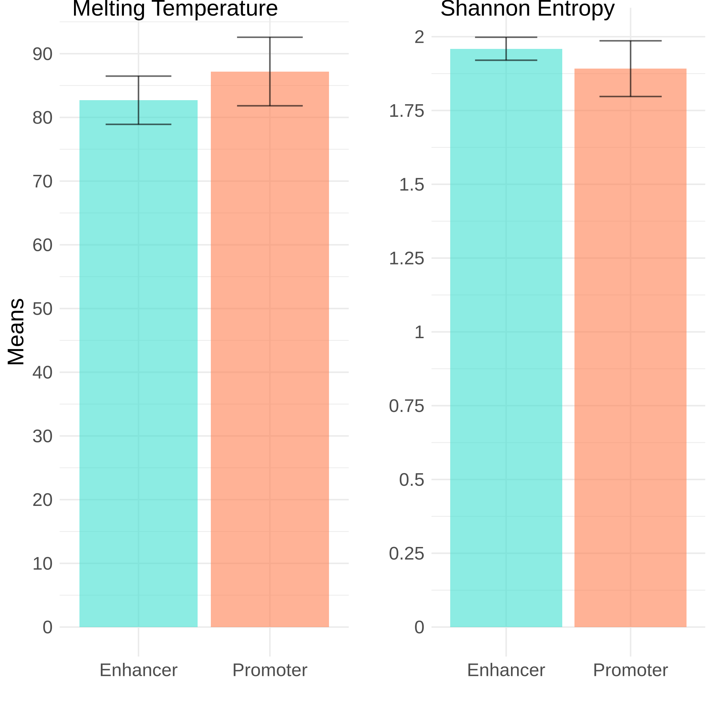
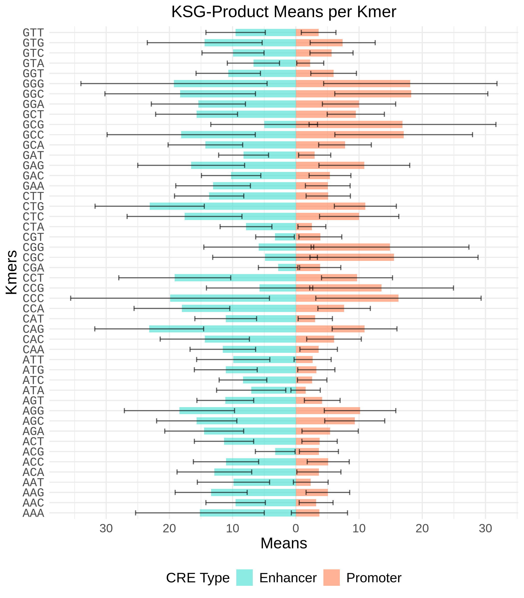
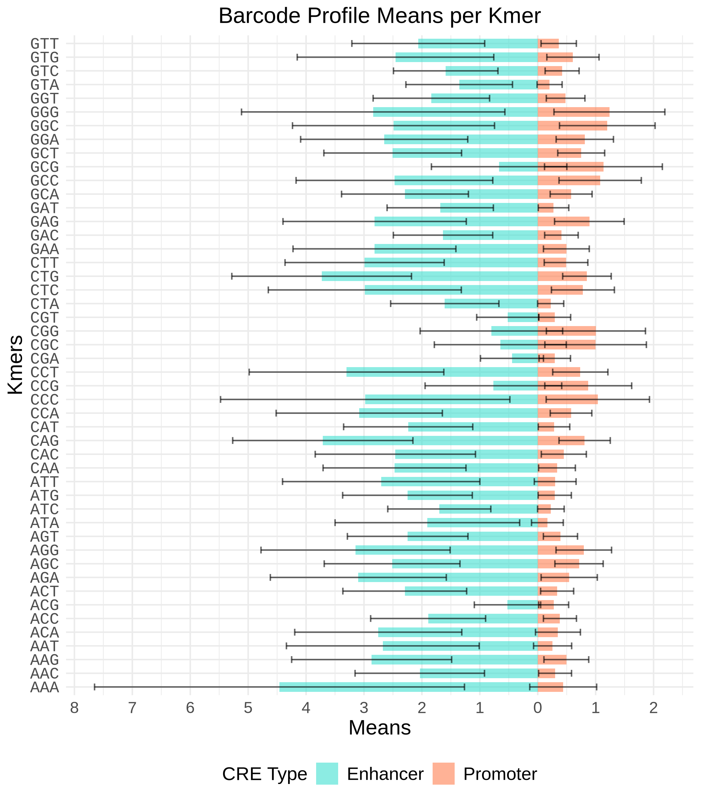

\newpage
\setlength\parindent{18pt}
\setlength\columnsep{18pt}
\twocolumn
# \texttt{Appendix: Custom Functions} {.unnumbered}

Many hurdles came across while trying to present code-cell outputs in *Quarto*, likely stemming 
from the fact that Quarto is a fairly new notebook format and therefore still has a lot of room 
for improvement. Despite these limitations, Quarto offers a distinct advantage that made me 
choose it for the current project: its' easy and intuitive integration of multiple programming 
languages at once. This capability is particularly valuable for bioinformatics workflows, where 
transitioning between *Bash*, *R*, and *Python* is often essential for comprehensive analyses.

Among the initial challenges I noticed with Quarto's output handling was that code-cell text, 
and sometimes code-cell output, would ignore \impw{column width} and overflow. First I sought 
a Quarto-specific solution, such as modifying the YAML or adjusting cell layout options, but 
none seemed to work and no there was no immediate intention to solve some issues (one example 
is the case of code-cell text overflowing in the PDF format export: 
[quarto-cli discussion \#3693](https://github.com/quarto-dev/quarto-cli/discussions/3693)).
The best option available I found was to "*chisel*" each code-cells' text myself (so that no 
line is larger than the column's width) and handle their respective output-wrapping through 
"*in-cell*" solutions: functions that capture and alter flawed outputs.

An example of such functions are the following '\fn{outputwrap1}' and '\fn{outputwrap}' functions, 
which were developed to address the issue of overflowing outputs from '\fn{list\_datasets}' and 
'\fn{info\_gb}'. The former '\fn{outputwrap1}', was the initial iteration created to handle this 
problem. However, even though successful at wrapping '\fn{list\_datasets}' output, '\fn{info\_gb}' 
would print part of its output before '\fn{outputwrap1}' could capture it. To solve this, I 
tried a new approach in '\fn{outputwrap}' by calling '\fn{info\_gb}' directly within the wrapping 
function, allowing it to capture the entire output. This adjustment turned out to be successful.

\vspace{0.22cm}
\begin{notebox}[center, width=0.95\columnwidth]{Note:}
Each time the programming language changes, the code-cell will 
display a header indicating the corresponding language.
\end{notebox}

\vspace{0.33cm}
\begin{pythonheader}
Python Code
\end{pythonheader}
\vspace{-1.75pt}


::: {.cell}

```{.python .cell-code}
import io, textwrap
from contextlib import redirect_stdout

def outputwrap1(output_func, set_width = 50):
	output = str(output_func)
	wrap_output = textwrap.fill(output,
                                width = set_width)
	print(wrap_output)

def outputwrap(output_func, width = 50, 
               args = (), kwargs = None):
    if kwargs is None:
        kwargs = {}
    output_stream = io.StringIO()
    with redirect_stdout(output_stream):
        func_df = output_func(*args, **kwargs)
    full_output = output_stream.getvalue()
    wrapped_output = textwrap.fill(full_output,
                                   width = width)
    subst_output = wrapped_output.replace(". ", ".\n\n")
    print(subst_output)
    print(func_df)
```
:::


Another instance of the output-wrapping function, but implemented in *R*, is in the 
following code-cell. Although, unlike its' counterparts in *Python*, this function
was specifically designed to manage the overflowing output of some vectors.

\vspace{0.33cm}
\begin{rheader}
R Code
\end{rheader}
\vspace{-1.75pt}


::: {.cell}

```{.r .cell-code}
outputwrap <- function(func_out, width = 50) {
  form_out <- format(round(func_out, digits = 2),
                     nsmall = 2)
  wrapped <- strwrap(gsub(',', '', toString(form_out)),
                     width = width)
  wrapped[1] <- paste("\n\n[1]", wrapped[1])
  len_w <- length(wrapped)
  wrapped[2:len_w] <- paste("\n   ", wrapped[2:len_w])
  cat(wrapped)
}
```
:::


Since some outputs are printed next to each other 
Subsequently, while employing Quarto's \impw{figrue layout features}, it was noticed how 
some of them would be printed immediately next to each other (row-wise), so the devised
solutions were the following functions, which attach some padding to the input provided 
and print an horizontal space ('\fn{addpadd}' and '\{hspace}' respectively).
within Quarto's cell, the following 


::: {.cell}

```{.r .cell-code}
addpadd <- function(func_out) {
  captout <- capture.output(func_out)
  captout[1] <- paste("\n", captout[1], sep="")
  captout[2:length(captout)] <- paste("\n",
            captout[2:length(captout)], sep="")
  captout <- append(captout, "\n\t")
  cat(captout)
}

hspace <- function()
  knitr::asis_output("\\textcolor{white}
	  {\\tiny\\texttt{hi}}\\normalsize")
```
:::


On the other hand, one inconvenient found in the "*sequence characterization*" step was the
necessity to call all the \impw{libraries} required by '\fn{sequence\_characterizer}' inside 
of its' surrounding '\fn{foreach}' chunk (even though they are already requested for in the 
first lines of 'genome-functions.R'). The easiest method I could come up with to solve this
is the following '\fn{required\_libs}' which suppresses the startup messages that, in this
context, only clutters the output.

\vspace{0.33cm}


::: {.cell}

```{.r .cell-code}
required_libs <- function(libs)
  for(lib in libs) suppressPackageStartupMessages(
                     library(lib, character.only = TRUE))
```
:::


Conversely, an inconvenience not related with Quarto was that for some reason the *LaTeX* 
command '\impw{\backslash twocolumn}' has incompatibilities with the *longtable* format from 
'\fn{knitr}' (their default type of table). This seemed to be a well documented issue
([knitr issues \#1348](https://github.com/yihui/knitr/issues/1348)) and the solution also seemed 
fairly simple (set the \fn{longtable} argument as \fn{FALSE}). Thereafter, '\fn{teatable}' is a 
function that does that coupled with a little bit more of \impw{table personalization}. An 
unexpected outcome of this workaround is that for some other reason each cell that uses 
'\fn{teatable}' (or '\fn{coffeetable}') require to have the Quarto cell feature 'cache' 
set to 'false', so that it is reloaded each time the notebook is rendered. The first 
version of '\fn{teatable}' was somethin like the code below:

\vspace{0.33cm}


::: {.cell}

```{.r .cell-code}
teetable <- function(tabl){
  kbl(
    as.data.frame(tabl), booktabs = T, longtable = F) %>%
    kable_styling(position = "center",
                  latex_options = c("striped",
                    "scale_down", "hold_position"))
}
```
:::


The name came from the fact that \impw{"kable"} might derive from \impw{"knitr\_table"} and I 
thought that I might as well name my table function(s) after types of furniture. Ultimately it 
was decided on \impw{"teatable"} because it was the shortest name I could come up with. 

The code below is the final version which displays a colored '\fn{teatable}'. The reason 
behind this was that I liked a lot the result obtained after coloring '\fn{coffeetable}'.

\vspace{0.33cm}


::: {.cell}

```{.r .cell-code}
teatable <- function(tabl, colsize, cat=FALSE,
                     decay=TRUE, pale = TRUE) {
  greens <- c("#a3cfa3", "#b3e6b3", "green!20")
  greens_decay <- c("#8c8c66", "#e6e6cc", "#c2c299")
  decayed_pale <- c("#ccccb3", "#f4f4e2", "#e0e0cc")

  if (!decay) { rowcolors <- greens
  } else { if (!pale) { rowcolors <- greens_decay
    } else { rowcolors <- decayed_pale } }

  ktabl <- 
    kbl(tabl, align = 'c',
        booktabs = TRUE, longtable = FALSE) %>%
       kable_styling(position = "center", 
                     latex_options=c("striped",
                                     "scale_down",
                                     "hold_position"),
                     stripe_color = rowcolors[3],
                     full_width = F) %>%
       row_spec(seq(2, nrow(tabl), by = 2),
                background = rowcolors[2]) %>%
       row_spec(0, background = rowcolors[1])

  if (!missing(colsize))
    ktabl <- ktabl %>% column_spec(1:ncol(tabl),
                                   width = colsize)
  ktabl <- gsub(x = ktabl, "\\\\midrule",
    "\\\\specialrule\\{0.6pt\\}\\{0.8pt\\}\\{0.6pt\\}")
  ktabl <- gsub(x = ktabl, "\\\\toprule",
    "\\\\specialrule\\{1pt\\}\\{0pt\\}\\{1pt\\}")
  ktabl <- gsub(x = ktabl, "\\\\bottomrule",
    "\\\\specialrule\\{1pt\\}\\{0.6pt\\}\\{0pt\\}")
  ktabl <- gsub(x = ktabl, "\\\\begin\\{table\\}([^\n]*)",
    "\\\\begin\\{table\\}\\1\n\\\\footnotesize")

  if (!cat) {asis_output(ktabl)} else {cat(ktabl)}
}
```
:::


The definition of '\fn{coffeetable}' is significantly larger than (and practically 
does the same as) '\fn{teatable}' plus some functions like: row height modification, 
collapse of columns (i.e. multi-rows) and dynamic coloring of multi-row cells.
Therefore, for the sake of readability, it was decided to leave it out of the 
current Appendix. 

One fun-fact about '\fn{coffetable}' is that the name actually comes from the amount
of coffee I needed to get to this workaround solution, seconds later I noticed the 
ironic coincidence between tea and coffee, and after that, I changed its' color 
theme to a brown-scale.

While plotting with '\fn{cowplot::plot\_grid}', I noticed it wouldn't display any 
\impw{bottom} legend coming from the '\fn{cowplot::get\_legend}' function. After 
googling it for a bit, it turned out to be apparently caused by a conflict between 
'\fn{cowplot}' and '\fn{ggplot2=3.5\*}'. Thankfully someone in the following GitHub 
([cowplot issue \#202](https://github.com/wilkelab/cowplot/issues/202)) issue came 
up with a solution, which I copyied as '\fn{get\_legend\_bypass}'.

\vspace{0.33cm}


::: {.cell}

```{.r .cell-code}
get_legend_bypass <- function(plot) { 
  legends <- get_plot_component(plot, "guide-box",
                                return_all = TRUE)
  nonzero <- vapply(legends, function(x)
                    !inherits(x,"zeroGrob"), TRUE)
  idx <- which(nonzero)
  if (length(idx) > 0) { return(legends[[idx[1]]])
  } else { return(legends[[1]]) }
}
```
:::


# Introduction
In this analysis, we explore methods to process, characterize, visualize and classify a preliminary set of activating cis-regulatory
sequences from promoters and enhancers. We started by downloading genomic data, preparing it in a compatible format, and applying 
several custom and existing tools for sequence characterization. The goal was to produce a robust dataset, prepare it for machine 
learning classification, and conduct exploratory analyses that highlight distinctive sequence features. Below, we outline the data 
acquisition, preparation, and characterization steps, as well as the libraries and custom functions employed.

# Data Preparation
## Downloading data
Although the initial intention was to use sequences from various \break public databases (like \impw{GeneHancer}, 
\impw{RefSeq}, \impw{ENCODE} and \impw{EPD} among others), it was suggested to run some tests with the easy-access 
data from \impw{genomic-benchmarks} (*Grešová et al., 2023*), so the first step was to explore all available datasets 
after downloading the corresponding \impw{python} package through '\fn{pip install genomic-benchmarks}'. 

After that, we have to '\fn{import}' the needed functions to explore the available datasets. It feels noteworthy 
to mention the importance of internet connectivity as a determining factor of the run-times of the following functions.

\vspace{0.33cm}
\begin{pythonheader}
Python Code
\end{pythonheader}
\vspace{-1.75pt}


::: {.cell}

```{.python .cell-code}
# To list available datasets
from genomic_benchmarks.data_check import \
	list_datasets

# To inspect each dataset to select two
from genomic_benchmarks.data_check import info as \
	info_gb

# To download each dataset
from genomic_benchmarks.loc2seq import \
	download_dataset

# To position ourselves in the correct directory
import os
```
:::


When displaying the available datasets, we can highlight the presence of four datasets containing \impw{human} 
regulatory elements: '\impw{\textit{non-TATA} promoters}', '\impw{enhancers \textit{Ensembl}}', '\impw{enhancers 
\textit{Cohn}}' and '\impw{\textit{Ensembl} regulatory}':

\vspace{0.5cm}


::: {.cell}

```{.python .cell-code}
list_datasets()
```
:::

::: {.cell}
::: {.cell-output .cell-output-stdout}

```
['human_nontata_promoters', 'drosophila_enhancers_stark',
'human_enhancers_cohn', 'dummy_mouse_enhancers_ensembl',
'human_ocr_ensembl', 'human_ensembl_regulatory',
'demo_human_or_worm', 'human_enhancers_ensembl',
'demo_coding_vs_intergenomic_seqs']
```


:::
:::


\vspace{0.5cm}


::: {.cell}

```{.python .cell-code}
info_gb("human_nontata_promoters", version=0)
```
:::

::: {.cell}
::: {.cell-output .cell-output-stdout}

```
Dataset `human_nontata_promoters` has 2 classes:
negative, positive.

 All lengths of genomic
intervals equals 251.

 Totally 36131 sequences
have been found, 27097 for training and 9034 for
testing.
          train  test
negative  12355  4119
positive  14742  4915
```


:::
:::


\vspace{0.5cm}


::: {.cell}

```{.python .cell-code}
info_gb("human_ensembl_regulatory", version=0)
```
:::

::: {.cell}
::: {.cell-output .cell-output-stdout}

```
Dataset `human_ensembl_regulatory` has 3 classes:
enhancer, ocr, promoter.

 The length of genomic
intervals ranges from 71 to 802, with average
429.91753643694585 and median 401.0.

 Totally
289061 sequences have been found, 231348 for
training and 57713 for testing.
          train   test
enhancer  85512  21378
ocr       69902  17476
promoter  75934  18859
```


:::
:::


\vspace{0.5cm}


::: {.cell}

```{.python .cell-code}
info_gb("human_enhancers_cohn", version=0)
```
:::

::: {.cell}
::: {.cell-output .cell-output-stdout}

```
Dataset `human_enhancers_cohn` has 2 classes:
negative, positive.

 All lengths of genomic
intervals equals 500.

 Totally 27791 sequences
have been found, 20843 for training and 6948 for
testing.
          train  test
negative  10422  3474
positive  10421  3474
```


:::
:::


\vspace{0.5cm}


::: {.cell}

```{.python .cell-code}
info_gb("human_enhancers_ensembl", version=0)
```
:::

::: {.cell}
::: {.cell-output .cell-output-stdout}

```
Dataset `human_enhancers_ensembl` has 2 classes:
negative, positive.

 The length of genomic
intervals ranges from 2 to 573, with average
268.8641324705183 and median 269.0.

 Totally
154842 sequences have been found, 123872 for
training and 30970 for testing.
          train   test
negative  61936  15485
positive  61936  15485
```


:::
:::


'OCR Ensembl':
\vspace{0.5cm}


::: {.cell}

```{.python .cell-code}
info_gb("human_ocr_ensembl", version=0)
```
:::

::: {.cell}
::: {.cell-output .cell-output-stdout}

```
Dataset `human_ocr_ensembl` has 2 classes:
negative, positive.

 The length of genomic
intervals ranges from 71 to 593, with average
326.3452470873675 and median 315.0.

 Totally
174756 sequences have been found, 139804 for
training and 34952 for testing.
          train   test
negative  69902  17476
positive  69902  17476
```


:::
:::


\vspace{0.5cm}


::: {.cell}

```{.python .cell-code}
os.chdir("/path/to/Project/datasets/GenomicBenchmarks")

download_dataset("human_nontata_promoters", version=0) 
download_dataset("human_enhancers_cohn", version=0) 
```
:::

::: {.cell}

:::


## Formatting data
The downloaded data consisted of multiple '*.txt*' files organized into two directories, and since at least the 
'*getShape()*' function from the '*DNAshapeR*' package required FASTA files to work, it felt right to integrate 
all sequences of each cis-regulatory element in a single FASTA file. For this, I gave them all a simple header 
and appended them together with *AWK*.

\begin{bashheader}
Bash Code
\end{bashheader}
\vspace{-1.75pt}


::: {.cell}

```{.bash .cell-code}
cd /path/to/Project/datasets/GenomicBenchmarks/

awk 'BEGIN{counter=0}
     {print ">promoter_"counter"|train|positive";
     print $0; counter+=1}' \
     human_nontata_promoters/train/positive/*.txt \
     > promoters_train_positive.fasta

awk 'BEGIN{counter=0}
     {print ">enhancer_"counter"|train|positive"; 
     print $0; counter+=1}' \
     human_enhancers_cohn/train/positive/*.txt \
     > enhancers_train_positive.fasta
```
:::

::: {.cell}

:::


# Data Characterization
## Libraries used
The following procedures require several R libraries, alongside custom functions 
developed for sequence characterization. The libraries and their respective roles 
in the analysis are outlined below:

\begin{rheader}
R Code
\end{rheader}
\vspace{-1.75pt}


::: {.cell}

```{.r .cell-code}
# For useful tools like 'filter'
library(dplyr)
library(plyr)
# For genome-functions.R
library(stringr)
library(stringi)
library(primes)
# For parallel computing
library(doParallel)
library(foreach)
# For biological functions: 
library(Biostrings)	# Local/Global Alignments
library(DNAshapeR)	# DNA Shape Features
# For plotting
library(paletteer)	# Color Palettes
library(cowplot)	# Plot Grids
library(ggplot2)
library(see)		# Half Violin Plots
# For pretty tables
library(knitr)
library(kableExtra)
# For my own functions
source("/path/to/Project/scripts/genome-functions.R")
source("/path/to/Project/scripts/custom-functions.R")
```
:::


## Characterizing sequences
Here, we characterize a subset from each of our datasets: 1638 sequences per 
regulatory element; 3276 in total. However, there's a circumstance about the 
sequences that has to be noted:

* Both datasets have considerably different elements lengthwise:

	1. All promoters have a length of 251 nucleotides.

    2. All enhancers have a length of 500 nucleotides.

* All features per sequence must be numerical and two-dimensional since we want
it to be fed eventually to a simple classifier (like a Support Vector Machine).


::: {.cell}

:::

::: {.cell}

```{.r .cell-code}
proj_path <- "path/to/Project/datasets/GenomicBenchmarks"
prom_fastaname <- "promoters_train_positive.fasta"
enha_fastaname <- "enhancers_train_positive.fasta"

prom_path <- paste(proj_path, prom_fastaname, sep = "/")
enha_path <- paste(proj_path, enha_fastaname, sep = "/")

# Scanning sequences
prom_seqs <- scan(prom_path, 
                  character(), quote="")[seq(2,29484,2)]
enha_seqs <- scan(enha_path, 
                  character(), quote="")[seq(2,20842,2)]
```
:::


Given some previous tests done to 'sequences_characterizer()' I came to the
conclusion that parallel computing might provide a higher and more complex
set of data in a feasible time span.

\vspace{0.5cm}


::: {.cell}

:::

::: {.cell}

```{.r .cell-code}
# Prepairing clusters for parallel computing
corescluster <- makeCluster(6)
registerDoParallel(corescluster)

# Characterizing sequences and exporting to CSV
list_seqs <- list(promoters = prom_seqs,
                  enhancers = enha_seqs)
reg_elems <- c("promoters", "enhancers")
libs <- c("stringr", "stringi", "primes")

for (reg_elem in reg_elems) {
  foreach(i = 1:6) %dopar% {
    required_libs(libs)
    i_start <- ((i - 1) * 273) + 1
    i_final <- i * 273

    if (i > 1) { # Only the first CSV has headers
      write.table(
        sequences_characterizer(
          list_seqs[[reg_elem]][i_start:i_final],
          optim = TRUE, k_max = 6),
        paste(
          "datasets/GB-Testing/test", reg_elem, 
          "-training_", i, ".csv", sep = ""), 
          row.names = FALSE, col.names = FALSE,
          sep = ",")

    } else {
	  write.csv(
        sequences_characterizer(
          list_seqs[[reg_elem]][i_start:i_final],
          optim = TRUE, k_max = 6),
        paste(
          "datasets/GB-Testing/", reg_elem,
          "-training_", i, ".csv", sep = ""),
          row.names = FALSE)
}}}
```
:::


## Concatenating CSV's
It was decided to produce many files instead of appending over the same CSV table in order to 
apply a sort of quality control checkup after the parallel computing was done. This, because when forcing the process 
RAM overload was possible and the function could die mid-process. Since our data was separated in six tables per 
cis-regulatory element, here we only join each set together in a single CSV.

\begin{bashheader}
Bash Code
\end{bashheader}
\vspace{-1.75pt}


::: {.cell}

:::

::: {.cell}

```{.bash .cell-code}
cat datasets/GB-Testing/testpromoters-training_*.csv \
    > datasets/GB-Testing/test-1638-promoters-6mers.csv
cat datasets/GB-Testing/testenhancers-training_*.csv \
    > datasets/GB-Testing/test-1638-enhancers-6mers.csv
```
:::


## Data description

\begin{table}[h]
\caption{Overview of each column generated so far by '\textit{sequences-characterizer()}'}
\small
\centering
% Using the new column types L, C, and R for custom width and orientation
\begin{tabular}{|L{1.5cm}|C{2.5cm}|C{4cm}|} 
\hline
\centering \textbf{Column} & \textbf{Description} & \textbf{Section Processed} \\
\hline
A & \parbox[c][1.2cm]{2.5cm}{\centering Percentage of Alanines} & \multirow{6}{*}{\underline{per Sequence}} \\
\cdashline{1-2}
T & \parbox[c][1.2cm]{2.5cm}{\centering Percentage of Thymines} & \\
\cdashline{1-2}
C & \parbox[c][1.2cm]{2.5cm}{\centering Percentage of Cytosines} & \\
\cdashline{1-2}
G & \parbox[c][1.2cm]{2.5cm}{\centering Percentage of Guanines} & \\
\cdashline{1-2}
temp & \parbox[c][1.2cm]{2.5cm}{\centering Melting Temperature} & \\
\cdashline{1-2}
shan & \parbox[c][1.2cm]{2.5cm}{\centering Shannon Coefficient} & \\
\hline
kN.M\_prod & \parbox[c][1.25cm]{2.5cm}{\centering KSG Product} & \multirow{4}{*}{\parbox[t]{4cm}{
\setlength\parindent{35pt}\underline{per Kmer:}\\\\
each possible kmer of \\ size \textit{N}
is identified on a \\ scale of 1 to
$4^N$ denoted \\ by \textit{M}.\\\\
\texttt{
i.e. k3.1 (or the first\\
kmer of size 3) would be\\
AAA; k4.2 would be AAAC\\
}
}} \\
\cdashline{1-2}
kN.M\_barc & \parbox[c][1.2cm]{2.5cm}{\centering Barcode Profile} & \\
\cdashline{1-2}
kN.M\_pals & \parbox[c][1.2cm]{2.5cm}{\centering Palindrome Profile} & \\
\cdashline{1-2}
kN.M\_revc & \parbox[c][1.7cm]{2.5cm}{\centering Reverse Complement Profile} & \\
\hline
\end{tabular}
\end{table}

Prior to our primary analysis, it feels reasonable to explain the columns per sequence produced by our
tabulator '*sequences_characterizer()*'. From here we'll first describe the ones computed sequence-wise, 
the ones computed kmer-wise, then the ones computed over each kmer distribution, and finally the ones 
corresponding to DNA-Shape; this feature comes at last considering '*getShape()*' function makes its' own 
dataframe. The ones in **black** are already integrated in the table, the ones in \color{red} **red** 
\color{black} are yet to be adjoined:

\underline{Per sequence}

* From *'genome-functions.R'*:
    * **A, T, C, G** - *Nucleotide Percentages* per sequence.

    * **temp** - \textit{Melting \underline{Temp}erature}: Temperature at which DNA's double helix dissociates 
	into single strands. *It's dependent on GC percentage and sequence length.*

    * **shan** - \textit{\underline{Shan}non Entropy Coefficient}: Statistical quantifier of information in a 
    system. Measures the uncertainty a set of data has. In this case is a nucleotide-diversity metric. 
    *It's dependent on nucleotide percentages.*

* From *'Biostrings'*:
	* \color{red}**la_sc** \color{black} - \textit{\underline{L}ocal \underline{A}lignment \underline{Sc}ore}

	* \color{red}**la_id** \color{black} - \textit{\underline{L}ocal \underline{A}lignment \underline{Id}entity}

	* \color{red}**ga_sc** \color{black} - \textit{\underline{G}lobal \underline{A}lignment \underline{Sc}ore}

	* \color{red}**ga_id** \color{black} - \textit{\underline{G}lobal \underline{A}lignment \underline{Id}entity}


\underline{Per kmer}

Kmer characterization came with many challenges, principally to provide each kmer with a distinct signature 
value dependent on their sequence structure. This under the assumption that .

* From *'genome-functions.R'*:
	* **kN.M_prod** - \textit{KSG \underline{Prod}uct}: Its obtained by multiplying \fontnimbussnn{\textbf{
	\underline{K}mer-Percentage * \underline{S}hannon Entropy * \underline{G}C-Percentage}} (*in concept*). 
	The justification for this comes from the desire to give each kmer a distictive signal based on their 
	sequence. However many kmers can produce the same value depending on the function, for example, the kmers 
	\fontnimbussnn{\textbf{'AAAT', 'ATAA', 'CCGC'}} and \fontnimbussnn{\textbf{'TGGG'}} all have the *same Entropy 
	Coefficient* (0.811), while \fontnimbussnn{\textbf{'GGAT', 'CAAG', 'AACC'}} and \fontnimbussnn{\textbf{'TGCT'}} 
	all have the *same GC Percentage* (0.5). Additionally, it is a little tricky to *keep the product from becoming 
	zero* when the sequence is either devoid of C/G nucleotides (e.g. \fontnimbussnn{\textbf{gc\_percentage('ATTA')
	=0}}), or lacks nucleotide diversity (e.g. \fontnimbussnn{\textbf{shannon\_entropy('GGGG')=0}}). 
	\newline\small\fontlibertser{Refer to 'Theory \& Code Annex', Sections 2 \& 3, for more details.}\normalsize

    * **kN.M_barc** - \textit{\underline{Barc}ode Profile}: Its obtained by generating a vector with size equal to
	the kmer amount (which is equivalent to \fontnimbussnn{\textbf{'sequence length'} - \textbf{'kmer length'} + 1})
	and filling it with one prime number per cell in ascending order. Afterwars we use a logical (\fontnimbussnn{
	\textbf{1's \& 0's}}) vector of the same size to represent each kmer's positions in the sequence. *In concept*, 
	if we multiply both vectors we will get a set of prime numbers representing the positions of each kmer inside 
	the sequence. If we multiply as well the elements inside this set, we will obtain an exlusive value for each 
	kmer in each sequence, and only the sequences with the same kmers in the same place will be divisible by the 
	corresponding prime.

    * **kN.M_pals** - \textit{\underline{Pal}indrome\underline{s}' Profile}:

    * **kN.M_revc** - \textit{\underline{Rev}erse \underline{C}omplement Profile}:

\underline{Per kmer distribution}

\underline{Per non-defined kmer}

* From *'DNAshapeR'*: \newline Generates a set features as vectors (EP, MGW, HelT, Roll & ProT by default) per provided 
FASTA file. Splits each sequence in sliding kmers of size 5 (pentamers) not defined by me, which therefore makes vector 
size dependent on sequence-length. The features intended to be used are:

	* \color{red}**sh_ep** \color{black} - Shape EP

	* \color{red}**sh_mgw** \color{black} - \textit{\underline{M}inor \underline{G}roove \underline{W}idth}

	* \color{red}**sh_helt** \color{black} - \textit{\underline{Hel}ix \underline{T}wist}

	* \color{red}**sh_prot** \color{black} - \textit{\underline{Pro}peller \underline{T}wist}

	* \color{red}**sh_roll** \color{black} - \textit{\underline{Roll}}

# Exploration analysis
## Primary analysis
Firstly we read our CSV tables into our conviniently named dataframes.

We could have concatenated both tables together, however I prefer to keep them in different files.
\begin{rheader}
R Code
\end{rheader}
\vspace{-1.75pt}


::: {.cell}

:::

::: {.cell}

```{.r .cell-code}
setwd("/path/to/Project/")
testdir_path <- "datasets/GB-Testing/"
prom_csvpath <- "test-1638-promoters-6mers.csv" 
enha_csvname <- "test-1638-enhancers-6mers.csv" 

proms <- read.csv(paste0(testdir_path, 
                         prom_csvname),
                         check.names = F)
enhas <- read.csv(paste0(testdir_path, 
                         enha_csvname),
                         check.names = F)
CREs <- c("Promoter","Enhancer")
```
:::


\vspace{0.2cm}

First we get an overviwew of the dimensions of our data:
NOTE: Replace this with some kind of table
\vspace{0.2cm}


::: {.cell layout-ncol="2"}

```{.r .cell-code}
deparse(substitute(proms))
```

::: {.cell-output .cell-output-stdout}

```
[1] "proms"
```


:::

```{.r .cell-code}
deparse(substitute(enhas))
```

::: {.cell-output .cell-output-stdout}

```
[1] "enhas"
```


:::

```{.r .cell-code}
dim(proms)
```

::: {.cell-output .cell-output-stdout}

```
[1]  1638 21830
```


:::

```{.r .cell-code}
dim(enhas)
```

::: {.cell-output .cell-output-stdout}

```
[1]  1638 21830
```


:::
:::


\vspace{0.2cm}

It's noticeable the fact that we have way more columns than rows in this test table.
Let's get a general glimpse of the first three promoters' rows by displaying the first 
3 lines and first 18 columns pertaining to all *sequence-wise* variables computed so far 
plus the first 12 *kmer-wise* variables, which align with the data related to the first 
3 kmers (\fontnimbussnn{\textbf{'AA', 'AC'} \& \textbf{'AG'}}):

\vspace{0.2cm}


::: {.cell}

```{.r .cell-code}
teatable(proms[1:3,1:18])
```
:::

::: {.cell}
::: {.cell-output-display}
\begin{table}[!h]
\footnotesize
\centering
\resizebox{\ifdim\width>\linewidth\linewidth\else\width\fi}{!}{
\begin{tabular}[t]{>{\centering\arraybackslash}p{5.75em}>{\centering\arraybackslash}p{5.75em}>{\centering\arraybackslash}p{5.75em}>{\centering\arraybackslash}p{5.75em}>{\centering\arraybackslash}p{5.75em}>{\centering\arraybackslash}p{5.75em}}
\specialrule{1pt}{0pt}{1pt}
\cellcolor[HTML]{ccccb3}{A} & \cellcolor[HTML]{ccccb3}{T} & \cellcolor[HTML]{ccccb3}{C} & \cellcolor[HTML]{ccccb3}{G} & \cellcolor[HTML]{ccccb3}{temp} & \cellcolor[HTML]{ccccb3}{shan}\\
\specialrule{0.6pt}{0.8pt}{0.6pt}
\cellcolor[HTML]{e0e0cc}{0.1673307} & \cellcolor[HTML]{e0e0cc}{0.2231076} & \cellcolor[HTML]{e0e0cc}{0.3306773} & \cellcolor[HTML]{e0e0cc}{0.2788845} & \cellcolor[HTML]{e0e0cc}{87.21315} & \cellcolor[HTML]{e0e0cc}{1.956136}\\
\cellcolor[HTML]{f4f4e2}{0.2629482} & \cellcolor[HTML]{f4f4e2}{0.2788845} & \cellcolor[HTML]{f4f4e2}{0.2549801} & \cellcolor[HTML]{f4f4e2}{0.2031873} & \cellcolor[HTML]{f4f4e2}{81.00598} & \cellcolor[HTML]{f4f4e2}{1.990374}\\
\cellcolor[HTML]{e0e0cc}{0.3625498} & \cellcolor[HTML]{e0e0cc}{0.2031873} & \cellcolor[HTML]{e0e0cc}{0.2470120} & \cellcolor[HTML]{e0e0cc}{0.1872510} & \cellcolor[HTML]{e0e0cc}{80.02590} & \cellcolor[HTML]{e0e0cc}{1.948719}\\
\specialrule{1pt}{0.6pt}{0pt}
\end{tabular}}
\end{table}
:::

::: {.cell-output-display}
\begin{table}[!h]
\footnotesize
\centering
\resizebox{\ifdim\width>\linewidth\linewidth\else\width\fi}{!}{
\begin{tabular}[t]{>{\centering\arraybackslash}p{5.75em}>{\centering\arraybackslash}p{5.75em}>{\centering\arraybackslash}p{5.75em}>{\centering\arraybackslash}p{5.75em}>{\centering\arraybackslash}p{5.75em}>{\centering\arraybackslash}p{5.75em}}
\specialrule{1pt}{0pt}{1pt}
\cellcolor[HTML]{ccccb3}{k2.1\_prod} & \cellcolor[HTML]{ccccb3}{k2.1\_barc} & \cellcolor[HTML]{ccccb3}{k2.1\_pals} & \cellcolor[HTML]{ccccb3}{k2.1\_revc} & \cellcolor[HTML]{ccccb3}{k2.2\_prod} & \cellcolor[HTML]{ccccb3}{k2.2\_barc}\\
\specialrule{0.6pt}{0.8pt}{0.6pt}
\cellcolor[HTML]{e0e0cc}{9} & \cellcolor[HTML]{e0e0cc}{1.959765} & \cellcolor[HTML]{e0e0cc}{2.177403e+09} & \cellcolor[HTML]{e0e0cc}{1.374020e+12} & \cellcolor[HTML]{e0e0cc}{17.11198} & \cellcolor[HTML]{e0e0cc}{1.531862}\\
\cellcolor[HTML]{f4f4e2}{17} & \cellcolor[HTML]{f4f4e2}{2.633165} & \cellcolor[HTML]{f4f4e2}{1.138401e+17} & \cellcolor[HTML]{f4f4e2}{2.971115e+17} & \cellcolor[HTML]{f4f4e2}{26.44579} & \cellcolor[HTML]{f4f4e2}{2.624612}\\
\cellcolor[HTML]{e0e0cc}{38} & \cellcolor[HTML]{e0e0cc}{5.347025} & \cellcolor[HTML]{e0e0cc}{3.981015e+36} & \cellcolor[HTML]{e0e0cc}{8.100763e+29} & \cellcolor[HTML]{e0e0cc}{24.89016} & \cellcolor[HTML]{e0e0cc}{1.855662}\\
\specialrule{1pt}{0.6pt}{0pt}
\end{tabular}}
\end{table}
:::

::: {.cell-output-display}
\begin{table}[!h]
\footnotesize
\centering
\resizebox{\ifdim\width>\linewidth\linewidth\else\width\fi}{!}{
\begin{tabular}[t]{>{\centering\arraybackslash}p{5.75em}>{\centering\arraybackslash}p{5.75em}>{\centering\arraybackslash}p{5.75em}>{\centering\arraybackslash}p{5.75em}>{\centering\arraybackslash}p{5.75em}>{\centering\arraybackslash}p{5.75em}}
\specialrule{1pt}{0pt}{1pt}
\cellcolor[HTML]{ccccb3}{k2.2\_pals} & \cellcolor[HTML]{ccccb3}{k2.2\_revc} & \cellcolor[HTML]{ccccb3}{k2.3\_prod} & \cellcolor[HTML]{ccccb3}{k2.3\_barc} & \cellcolor[HTML]{ccccb3}{k2.3\_pals} & \cellcolor[HTML]{ccccb3}{k2.3\_revc}\\
\specialrule{0.6pt}{0.8pt}{0.6pt}
\cellcolor[HTML]{e0e0cc}{3.845422e+15} & \cellcolor[HTML]{e0e0cc}{3.525451e+11} & \cellcolor[HTML]{e0e0cc}{26.44579} & \cellcolor[HTML]{e0e0cc}{2.445328} & \cellcolor[HTML]{e0e0cc}{4.788062e+13} & \cellcolor[HTML]{e0e0cc}{1.305836e+26}\\
\cellcolor[HTML]{f4f4e2}{2.607331e+20} & \cellcolor[HTML]{f4f4e2}{6.308689e+14} & \cellcolor[HTML]{f4f4e2}{24.89016} & \cellcolor[HTML]{f4f4e2}{2.513656} & \cellcolor[HTML]{f4f4e2}{1.320117e+14} & \cellcolor[HTML]{f4f4e2}{6.435389e+19}\\
\cellcolor[HTML]{e0e0cc}{1.156904e+25} & \cellcolor[HTML]{e0e0cc}{3.573059e+12} & \cellcolor[HTML]{e0e0cc}{34.22397} & \cellcolor[HTML]{e0e0cc}{3.431445} & \cellcolor[HTML]{e0e0cc}{6.011592e+17} & \cellcolor[HTML]{e0e0cc}{7.178542e+17}\\
\specialrule{1pt}{0.6pt}{0pt}
\end{tabular}}
\end{table}
:::
:::


\vspace{0.2cm}

We'll get a similar panorama when looking at the first three enhancers' rows
(although it seems like *'barcode'* values appear to be significantly larger):

\vspace{0.2cm}


::: {.cell}

```{.r .cell-code}
teatable(enhas[1:3,1:18])
```
:::

::: {.cell}
::: {.cell-output-display}
\begin{table}[!h]
\footnotesize
\centering
\resizebox{\ifdim\width>\linewidth\linewidth\else\width\fi}{!}{
\begin{tabular}[t]{>{\centering\arraybackslash}p{6em}>{\centering\arraybackslash}p{6em}>{\centering\arraybackslash}p{6em}>{\centering\arraybackslash}p{6em}>{\centering\arraybackslash}p{6em}>{\centering\arraybackslash}p{6em}}
\specialrule{1pt}{0pt}{1pt}
\cellcolor[HTML]{ccccb3}{A} & \cellcolor[HTML]{ccccb3}{T} & \cellcolor[HTML]{ccccb3}{C} & \cellcolor[HTML]{ccccb3}{G} & \cellcolor[HTML]{ccccb3}{temp} & \cellcolor[HTML]{ccccb3}{shan}\\
\specialrule{0.6pt}{0.8pt}{0.6pt}
\cellcolor[HTML]{e0e0cc}{0.240} & \cellcolor[HTML]{e0e0cc}{0.236} & \cellcolor[HTML]{e0e0cc}{0.234} & \cellcolor[HTML]{e0e0cc}{0.290} & \cellcolor[HTML]{e0e0cc}{85.0392} & \cellcolor[HTML]{e0e0cc}{1.993988}\\
\cellcolor[HTML]{f4f4e2}{0.204} & \cellcolor[HTML]{f4f4e2}{0.286} & \cellcolor[HTML]{f4f4e2}{0.210} & \cellcolor[HTML]{f4f4e2}{0.300} & \cellcolor[HTML]{f4f4e2}{84.4652} & \cellcolor[HTML]{f4f4e2}{1.978249}\\
\cellcolor[HTML]{e0e0cc}{0.250} & \cellcolor[HTML]{e0e0cc}{0.280} & \cellcolor[HTML]{e0e0cc}{0.258} & \cellcolor[HTML]{e0e0cc}{0.212} & \cellcolor[HTML]{e0e0cc}{82.8252} & \cellcolor[HTML]{e0e0cc}{1.992923}\\
\specialrule{1pt}{0.6pt}{0pt}
\end{tabular}}
\end{table}
:::

::: {.cell-output-display}
\begin{table}[!h]
\footnotesize
\centering
\resizebox{\ifdim\width>\linewidth\linewidth\else\width\fi}{!}{
\begin{tabular}[t]{>{\centering\arraybackslash}p{6em}>{\centering\arraybackslash}p{6em}>{\centering\arraybackslash}p{6em}>{\centering\arraybackslash}p{6em}>{\centering\arraybackslash}p{6em}>{\centering\arraybackslash}p{6em}}
\specialrule{1pt}{0pt}{1pt}
\cellcolor[HTML]{ccccb3}{k2.1\_prod} & \cellcolor[HTML]{ccccb3}{k2.1\_barc} & \cellcolor[HTML]{ccccb3}{k2.1\_pals} & \cellcolor[HTML]{ccccb3}{k2.1\_revc} & \cellcolor[HTML]{ccccb3}{k2.2\_prod} & \cellcolor[HTML]{ccccb3}{k2.2\_barc}\\
\specialrule{0.6pt}{0.8pt}{0.6pt}
\cellcolor[HTML]{e0e0cc}{36} & \cellcolor[HTML]{e0e0cc}{10.432345} & \cellcolor[HTML]{e0e0cc}{1.885437e+37} & \cellcolor[HTML]{e0e0cc}{8.632413e+30} & \cellcolor[HTML]{e0e0cc}{24.89016} & \cellcolor[HTML]{e0e0cc}{6.027803}\\
\cellcolor[HTML]{f4f4e2}{20} & \cellcolor[HTML]{f4f4e2}{6.153015} & \cellcolor[HTML]{f4f4e2}{5.673403e+20} & \cellcolor[HTML]{f4f4e2}{1.061673e+53} & \cellcolor[HTML]{f4f4e2}{23.33452} & \cellcolor[HTML]{f4f4e2}{4.984254}\\
\cellcolor[HTML]{e0e0cc}{31} & \cellcolor[HTML]{e0e0cc}{9.936447} & \cellcolor[HTML]{e0e0cc}{1.640775e+32} & \cellcolor[HTML]{e0e0cc}{5.563175e+39} & \cellcolor[HTML]{e0e0cc}{46.66905} & \cellcolor[HTML]{e0e0cc}{9.301359}\\
\specialrule{1pt}{0.6pt}{0pt}
\end{tabular}}
\end{table}
:::

::: {.cell-output-display}
\begin{table}[!h]
\footnotesize
\centering
\resizebox{\ifdim\width>\linewidth\linewidth\else\width\fi}{!}{
\begin{tabular}[t]{>{\centering\arraybackslash}p{6em}>{\centering\arraybackslash}p{6em}>{\centering\arraybackslash}p{6em}>{\centering\arraybackslash}p{6em}>{\centering\arraybackslash}p{6em}>{\centering\arraybackslash}p{6em}}
\specialrule{1pt}{0pt}{1pt}
\cellcolor[HTML]{ccccb3}{k2.2\_pals} & \cellcolor[HTML]{ccccb3}{k2.2\_revc} & \cellcolor[HTML]{ccccb3}{k2.3\_prod} & \cellcolor[HTML]{ccccb3}{k2.3\_barc} & \cellcolor[HTML]{ccccb3}{k2.3\_pals} & \cellcolor[HTML]{ccccb3}{k2.3\_revc}\\
\specialrule{0.6pt}{0.8pt}{0.6pt}
\cellcolor[HTML]{e0e0cc}{1.579134e+29} & \cellcolor[HTML]{e0e0cc}{1.707234e+31} & \cellcolor[HTML]{e0e0cc}{76.22611} & \cellcolor[HTML]{e0e0cc}{13.43518} & \cellcolor[HTML]{e0e0cc}{3.557032e+41} & \cellcolor[HTML]{e0e0cc}{5.830130e+44}\\
\cellcolor[HTML]{f4f4e2}{4.485619e+32} & \cellcolor[HTML]{f4f4e2}{1.810188e+35} & \cellcolor[HTML]{f4f4e2}{73.11484} & \cellcolor[HTML]{f4f4e2}{13.29662} & \cellcolor[HTML]{f4f4e2}{3.273426e+39} & \cellcolor[HTML]{f4f4e2}{3.755909e+39}\\
\cellcolor[HTML]{e0e0cc}{9.951038e+37} & \cellcolor[HTML]{e0e0cc}{3.612544e+25} & \cellcolor[HTML]{e0e0cc}{60.66976} & \cellcolor[HTML]{e0e0cc}{12.53356} & \cellcolor[HTML]{e0e0cc}{4.255600e+33} & \cellcolor[HTML]{e0e0cc}{3.010280e+57}\\
\specialrule{1pt}{0.6pt}{0pt}
\end{tabular}}
\end{table}
:::
:::

::: {.cell}

```{.r .cell-code}
mean_prom <- colMeans(proms)
mean_enha <- colMeans(enhas)
sd_prom <- apply(proms, 2, sd)
sd_enha <- apply(enhas, 2, sd)

names_CREs <- rep(CREs, each = length(proms))
cre_summary <- data.frame(Type = factor(names_CREs),
                          Field = rep(names(proms),2),
                          Means = c(mean_prom,mean_enha),
                          StDevs = c(sd_prom,sd_enha))
```
:::

::: {.cell}

```{.r .cell-code}
ldf <- length(proms)
coffeetable(cre_summary[c(1:10,(ldf+1):(ldf+10)),])
```

::: {.cell-output-display}
\begin{table}[!h]
\centering
\footnotesize
\renewcommand{\arraystretch}{1.3}
\resizebox{\ifdim\width>\linewidth\linewidth\else\width\fi}{!}{
\begin{tabular}[t]{lllrr}
\specialrule{1pt}{0pt}{0.5pt}
\rowcolor{brown!42}
  & Type & Field & Means & StDevs\\
\specialrule{0.6pt}{1pt}{0pt}
\rowcolor{brown!25}
1 & \cellcolor{brown!10} & A & 1.911256e-01 & 7.145510e-02\\[-0.12pt]
\rowcolor{brown!10}
2 & \cellcolor{brown!10} & T & 1.995826e-01 & 7.599340e-02\\[-0.12pt]
\rowcolor{brown!25}
3 & \cellcolor{brown!10} & C & 2.962655e-01 & 8.067840e-02\\[-0.12pt]
\rowcolor{brown!10}
4 & \cellcolor{brown!10} & G & 3.130263e-01 & 8.524230e-02\\[-0.12pt]
\rowcolor{brown!25}
5 & \cellcolor{brown!10} & temp & 8.720208e+01 & 5.379461e+00\\[-0.12pt]
\rowcolor{brown!10}
6 & \cellcolor{brown!10} & shan & 1.891724e+00 & 9.437000e-02\\[-0.12pt]
\rowcolor{brown!25}
7 & \cellcolor{brown!10} & k2.1\_prod & 1.196276e+01 & 8.995306e+00\\[-0.12pt]
\rowcolor{brown!10}
8 & \cellcolor{brown!10} & k2.1\_barc & 1.500971e+00 & 1.229003e+00\\[-0.12pt]
\rowcolor{brown!25}
9 & \cellcolor{brown!10} & k2.1\_pals & 2.634405e+51 & 1.065029e+53\\[-0.12pt]
\rowcolor{brown!10}
10 & \multirow{-10}{*}{\raggedright\arraybackslash\cellcolor{brown!10} Promoter} & k2.1\_revc & 9.789346e+62 & 3.960331e+64\\[-0.12pt]
\rowcolor{brown!25}
21831 & \cellcolor{brown!25} & A & 2.653712e-01 & 5.853000e-02\\[-0.12pt]
\rowcolor{brown!10}
21832 & \cellcolor{brown!25} & T & 2.678205e-01 & 5.815610e-02\\[-0.12pt]
\rowcolor{brown!25}
21833 & \cellcolor{brown!25} & C & 2.351111e-01 & 5.648440e-02\\[-0.12pt]
\rowcolor{brown!10}
21834 & \cellcolor{brown!25} & G & 2.316972e-01 & 5.435370e-02\\[-0.12pt]
\rowcolor{brown!25}
21835 & \cellcolor{brown!25} & temp & 8.269434e+01 & 3.785299e+00\\[-0.12pt]
\rowcolor{brown!10}
21836 & \cellcolor{brown!25} & shan & 1.959202e+00 & 3.892580e-02\\[-0.12pt]
\rowcolor{brown!25}
21837 & \cellcolor{brown!25} & k2.1\_prod & 4.093346e+01 & 1.835697e+01\\[-0.12pt]
\rowcolor{brown!10}
21838 & \cellcolor{brown!25} & k2.1\_barc & 1.208127e+01 & 5.751107e+00\\[-0.12pt]
\rowcolor{brown!25}
21839 & \cellcolor{brown!25} & k2.1\_pals & 2.567318e+112 & 1.038419e+114\\[-0.12pt]
\rowcolor{brown!10}
21840 & \multirow{-10}{*}{\raggedright\arraybackslash\cellcolor{brown!25} Enhancer} & k2.1\_revc & 3.321646e+121 & 1.344343e+123\\[-0.12pt]
\bottomrule
\end{tabular}}
\renewcommand{\arraystretch}{1}

\end{table}
:::
:::


This text should be later deleted


::: {.cell layout-nrow="3"}

```{.r .cell-code .code-overflow-wrap}
# Get only 'prod' columns of each kmer

k_Ns <- c(n_ki(2), n_ki(3), n_ki(4), n_ki(5), n_ki(6)) 
k_inds <- c(0)
for (k_n in k_Ns) {
  k_inds <- c(k_inds, tail(k_inds,1) + 1)
  k_inds <- c(k_inds, tail(k_inds,2)[1] + k_n)
}
k_inds <- k_inds[-1]
# print(rev(k_inds)[1])
# print((ldf-6)/4)
# print(ldf)
```
:::

::: {.cell layout-align="center" crop='true'}

```{.r .cell-code}
kmer_set_sizes <- data.frame(sizes = k_Ns,
  k_sets = c("2","3","4","5","6"))

ggplot(kmer_set_sizes, aes(x = "", y = sizes,
                           fill = k_sets))+ 
  geom_bar(width = 1, stat = "identity") + 
  labs(y = "Count", x = "", 
       title = "Kmers per Kmer Size", 
       fill = "k =") +
  coord_polar("y", start = 0) +
  theme_minimal() +
  scale_fill_paletteer_d("PNWColors::Bay") +
  theme(legend.position = "right", 
        axis.title = element_text(size = 15),
        text = element_text(size = rel(4.25)),
        legend.text = element_text(size = 13),
        legend.title = element_text(size = 13.5),
        axis.text.y = element_text(family = "mono"),
        plot.title = element_text(size = 16, hjust = 0.5))
```

::: {.cell-output-display}
{fig-align='center' fig-pos='H'}
:::
:::

::: {.cell}

```{.r .cell-code}
pe_arr <- function(seq_data)
  return(array(seq_data, dim = c(rev(k_inds)[1], 2),
    dimnames = list(1:rev(k_inds)[1], c("prom","enha"))))

indxs <- list(
  prod = pe_arr(c(seq(7,ldf-3,4), ldf+seq(7,ldf-3,4))),
  barc = pe_arr(c(seq(8,ldf-2,4), ldf+seq(8,ldf-2,4))),
  pals = pe_arr(c(seq(9,ldf-1,4), ldf+seq(9,ldf-1,4))),
  revc = pe_arr(c(seq(10,ldf,4), ldf+seq(10,ldf,4))))
```
:::


Now, for the sake of text-space optimization, we'll make some plotting
functions (principally pyramid, bar and violin plots), in order to 
visualize our data. 


::: {.cell}

```{.r .cell-code}
# To plot pyramid-plots
pyrplot_ <- function(cre_data, kmer_labels, title, 
                    x_label, y_label, y_breaks) {
  CREs <- c("Enhancer", "Promoter")
  field_order <- filter(cre_data, Type==CREs[1])$Field
  fact_field_order <- factor(cre_data$Field, field_order)

  if (missing(kmer_labels)) kmer_labels <- field_order

  ggplot(cre_data) +
    geom_bar(aes(x = fact_field_order, 
                 y = ifelse(Type == CREs[1],
                            -Means, Means), 
                 fill = paste(Type, "Means")),
             stat = "identity", position = "identity", 
             alpha = 0.6, width = 0.7) +
    geom_errorbar(aes(x = fact_field_order,
                      ymin = ifelse(Type == CREs[1],
                                   -Means + StDevs,
	                                Means - StDevs),
                      ymax = ifelse(Type == CREs[1],
                                   -Means - StDevs,
                                    Means + StDevs)),
                  width = 0.5, alpha = 0.6,
                  colour = "black") +
    coord_flip() +
    scale_x_discrete(labels = kmer_labels) +
    scale_y_continuous(breaks = y_breaks,
                       labels = abs(y_breaks)) +
    scale_fill_manual(values = c("turquoise", "coral"),
                      labels = CREs) +
    labs(y = "Means", x = x_label,
         title = title, fill = "CRE Type") +
    theme_minimal() +
    theme(legend.position = "bottom",
          axis.title = element_text(size = 15),
          text = element_text(size = rel(4.25)),
          legend.text = element_text(size = 13),
          legend.title = element_text(size = 13.5),
          axis.text.y = element_text(family = "mono"),
          plot.title = element_text(size = 16, hjust = 0.5))
}

barplot_ <- function(cre_data, y_breaks, y_axis_title="",
					 fill_legend_title="") {
  ggplot(cre_data) +
    geom_bar(aes(x = factor(Type), 
                 y = Means, fill = Type),
             stat = "identity", position = "identity",
             alpha = 0.6) +
    geom_errorbar(aes(x = factor(Type), 
                      ymin = Means - StDevs,
                      ymax = Means + StDevs),
                  alpha = 0.6, width = 0.5,
                  colour = "black") +
    labs(y = y_axis_title, x = "",
         fill = fill_legend_title) +
    scale_y_continuous(breaks = y_breaks,
                       labels = y_breaks) +
    scale_fill_manual(values = c("turquoise", "coral")) +
    theme_minimal() +
    theme(legend.position = "none",
          text = element_text(size = rel(4.5)),
          axis.title = element_text(size = 16))
}

hvioplot_ <- function(data, y_var, y_label = "",
                     fill_legend_title = "") {
  # x_breaks <- seq(-0.12,0.12,0.06)
  ggplot(data, aes(x = 0, y = !!sym(y_var), fill = type)) +
    geom_violinhalf(flip = 1, adjust = 0.25,
                    trim = FALSE, scale = "count",
                    position = position_dodge(width = 0),
                    linewidth = 0.1, alpha = 0.6) +
    theme_minimal() +
    # scale_x_continuous(breaks = x_breaks ,
    #                    labels = abs(x_breaks )) +
    scale_fill_manual(values = c("turquoise", "coral")) +
    labs(x = "", y = y_label, fill = fill_legend_title) +
    theme(legend.position = "none",
          text = element_text(size = rel(4.5)),
          axis.title = element_text(size = 13))
}
```
:::

::: {.cell}

:::

::: {.cell layout-align="center" row='screen' crop='true'}

```{.r .cell-code}
pyrplot_(cre_summary[c(1:4, ldf + (1:4)), ], 
      x_label = "Nucleotides", y_breaks = seq(-1,1,0.2), 
      title = "Percentage Means per Nucleotide")
```

::: {.cell-output-display}
{fig-align='center' fig-pos='H'}
:::
:::

::: {.cell}

```{.r .cell-code}
data_e <- cbind(type = rep("Enhancer",
                length(enhas$temp)), enhas[,5:6])
data_p <- cbind(type = rep("Promoter",
                length(proms$temp)), proms[,5:6])
subset_tm_sh <- rbind(data_e, data_p)
```
:::

::: {.cell layout-align="center" row='screen' crop='true'}

```{.r .cell-code}
# Saving Melting Temperature Violin Plot 
tm_violin <- hvioplot_(data = subset_tm_sh, 
                       y_var = "temp", 
                       y_label = "Density")

# Saving Shannon Violin Plot 
sh_violin <- hvioplot_(data = subset_tm_sh, 
                       y_var = "shan", 
                       fill_legend_title = "CRE Type")

# Get legend
legend_violin <- get_legend_bypass(sh_violin +
  guides(color = guide_legend(nrow = 1)) +
  theme(legend.position = "bottom",
        legend.title = element_text(size = 13.5),
        legend.text = element_text(size = 13)))

# Merging of Violin-Plots 
grid_violin <- plot_grid(tm_violin, sh_violin, NULL,
                 ncol = 3, rel_widths = c(1,1,0.1),
                 labels = c("Melting Temperature",
                 "Shannon Entropy"), label_size = 16,
                 label_fontface = "plain", vjust = 1,
                 hjust = c(-0.38, -0.48))

# Adding legend at the bottom
plot_grid(grid_violin, legend_violin,
          ncol = 1, rel_heights = c(12,1))
```

::: {.cell-output-display}
{fig-align='center' fig-pos='H'}
:::
:::

::: {.cell layout-align="center" row='screen' crop='true'}

```{.r .cell-code}
# Saving Melting Temperature Bar-Plot
temp_plot <- barplot_(filter(cre_summary, Field=="temp"), 
                      y_breaks = seq(0, 100, 10), 
                      y_axis_title = "Means")

# Saving Shannon Coefficient Bar-Plot
shan_plot <- barplot_(filter(cre_summary, Field=="shan"), 
                      y_breaks = seq(0, 2, 0.25), 
                      fill_legend_title = "CRE Type")

# Merging of Bar-Plots
plot_grid(temp_plot, shan_plot,  
    ncol = 2, rel_widths = c(1,1), 
    vjust = 1, hjust = c(-0.35, -0.48),
    label_size = 16, label_fontface = "plain",
    labels = c("Melting Temperature", "Shannon Entropy")) 
```

::: {.cell-output-display}
{fig-align='center' fig-pos='H'}
:::
:::

::: {.cell layout-align="center" row='screen'}

```{.r .cell-code}
kmer_names <- combi_kmers(k=3)[1:48]

pyrplot_(cre_summary[indxs$prod[17:64,],], kmer_names,
         x_label = "Kmers", y_breaks = seq(-30,30,10), 
         title = "KSG-Product Means per Kmer")
```

::: {.cell-output-display}
{fig-align='center' fig-pos='H'}
:::

```{.r .cell-code}
pyrplot_(cre_summary[indxs$barc[17:64,],], kmer_names,
         x_label = "Kmers", y_breaks = seq(-10,10,1), 
         title = "Barcode Profile Means per Kmer")
```

::: {.cell-output-display}
{fig-align='center' fig-pos='H'}
:::
:::

